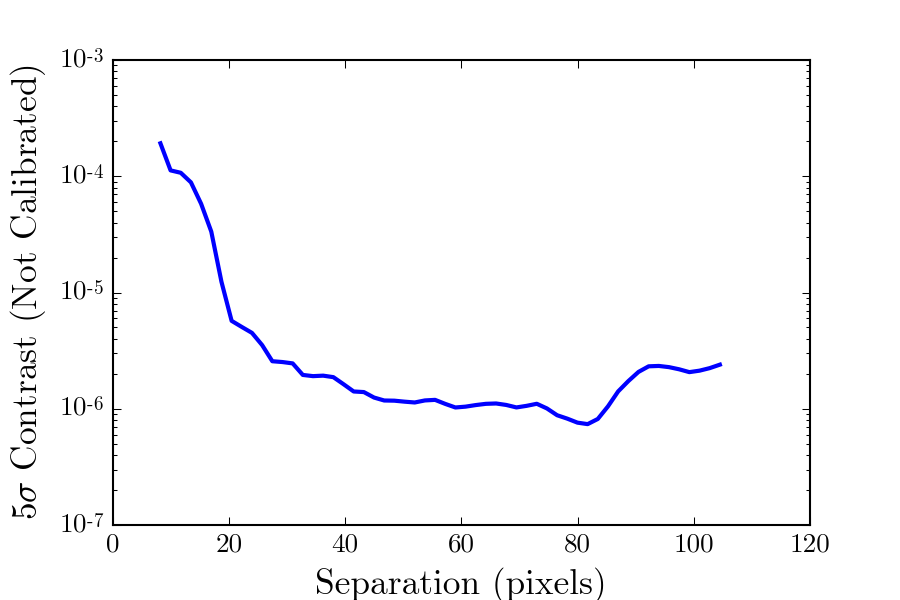
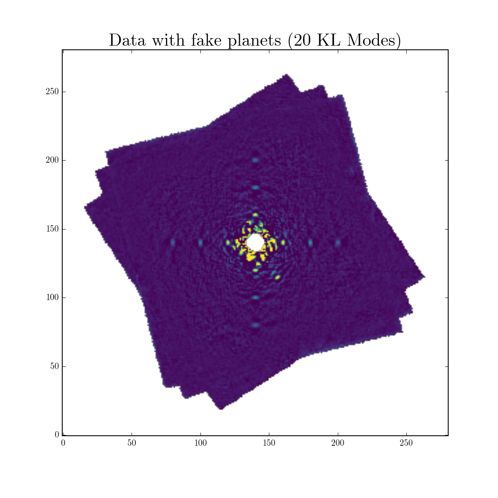
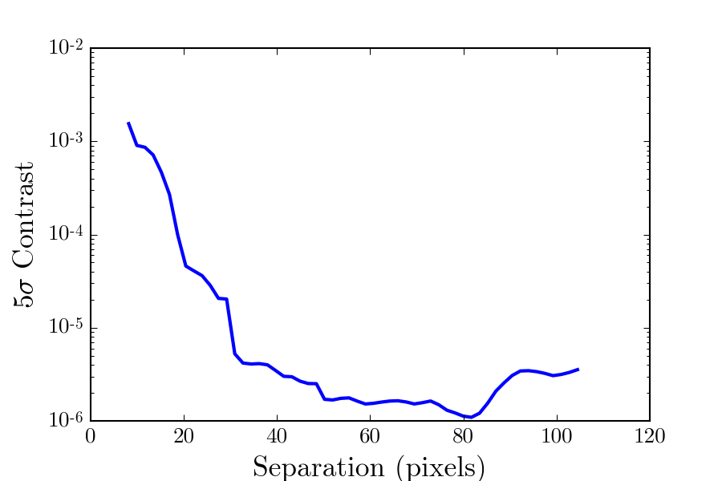

.. _contrast-label:

Calibrating Algorithm Throughput & Generating Contrast Curves
=============================================================

Due to oversubtraction and selfsubtraction (see `Pueyo (2016) <http://arxiv.org/abs/1604.06097>`_ for a good
explaination), the shape, flux, and spectrum of the signal of a planet or disk is distoed by PSF subtraction.
To calibrate algorithm throughput after KLIP in this tutorial, we will use the standard fake injection technique,
which basically is injecting fake planets/disks in the data of known shape, flux, and spectrum to measure the
algorithm throughput.

In this tutorial, we will calibrate the throughput of the previous exmaple (:ref:`basic-tutorial-label`) for the
purpose of generating a contrast curve. Note that this same general process can be used to character a planet or disk
(e.g. measure astrometry and spectrum of an imaged exoplanet).

Contrast Curves
---------------

To measure the contrast (ignoring algorithm throughput), we use :meth:`pyklip.klip.meas_contrast`, which assumes
azimuthally symmetric noise and computes the 5σ noise level at each separation. It uses a Gaussian cross correlation to
compute the noise as a small optimization to smooth out high frequency noise (since we know our planet is not going to
be smaller than on λ/D scales). It also corrects for small number statistics (i.e. by assuming a Student's
t-distribution rather than a Gaussian).
This will give us a sense of the contrast to inject fake planets into the data (algorithm throughput is ~50%).
We are calculating broadband contrast so we want to spectrally-collapsed data (if applicable). You can do this
by reading back in the KL mode cube and picking a KL mode cutoff. (The KL mode cutoff is chosen to maximize planet SNR, which we won't discuss here, but can be determined with fake planet injection.)

Here we will show an example using the pyKLIP output of GPI data, and using KL modes.

.. code-block:: python

    import astropy.io.fits as fits
    hdulist = fits.open("myobject-KLmodes-all.fits")
    # pick the 20 KL mode cutoff frame out of [1,20,50,100]
    kl20frame = hdulist[1].data[1]
    dataset_center = [hdulist[1].header['PSFCENTX'], hdulist[1].header['PSFCENTY'] ]

Then, a convenient pyKLIP function will calculate the contrast, accounting for small
sample statistics. We are picking 1.1 arcseconds as the outer boundary of our contrast curve.
The `low_pass_filter` option specifies the size of the Gaussian to use in our cross correlation to smooth low frequency noise.
It is typically smaller than the size of the PSF since self-subtraction from KLIP decreases the PSF size.
We also need to specify the FWHM of the PSF in order to account for small sample statistics. It also determines
the spacing the contrast curve returns. The function samples the noise with a spacing of FWHM/2.

For our example dataset on Beta Pic, we also need to mask out the planet, Beta Pic b, so that it doesn't bias our noise estimate.

.. code-block:: python

    import numpy as np
    import pyklip.klip as klip
    import pyklip.instruments.GPI as GPI

    dataset_iwa = GPI.GPIData.fpm_diam['J']/2 # radius of occulter
    dataset_owa = 1.5/GPI.GPIData.lenslet_scale # 1.5" is the furtherest out we will go
    dataset_fwhm = 3.5 # fwhm of PSF roughly
    low_pass_size = 1. # pixel, corresponds to the sigma of the Gaussian

    # mask beta Pic b
    # first get the location of the planet from Wang+ (2016)
    betapicb_sep = 30.11 # pixels
    betapicb_pa = 212.2 # degrees
    betapicb_x = betapicb_sep * -np.sin(np.radians(betapicb_pa)) + dataset_center[0]
    betapicb_y = betapicb_sep * np.cos(np.radians(betapicb_pa)) + dataset_center[1]
    # now mask the data
    ydat, xdat = np.indices(kl20frame.shape)
    distance_from_planet = np.sqrt((xdat - betapicb_x)**2 + (ydat - betapicb_y)**2)
    kl20frame[np.where(distance_from_planet <= 2*dataset_fwhm)] = np.nan

    contrast_seps, contrast = klip.meas_contrast(kl20frame, dataset_iwa, dataset_owa, dataset_fwhm, center=dataset_center, low_pass_filter=low_pass_size)

Now we can plot what the contrast curve (missing a calibration for algorithm throughput) looks like.

Injecting Fake Planets
----------------------
KLIP naturally subtracts out planet flux due to over-subtraction and self-subtraction.
To calibrate our sensitivity to planets, we need to inject some fake planets at known brightness into our data to calibrate KLIP attenuation.
In this tutorial, we only only inject a few fakes once into the data just to demonstrate the technique with pyKLIP. For your
data, it is suggested you inject many planets to explore the attenuation factor as a function of brightness,
separation, and KLIP parameters (more aggressive reductions increase attenuation of flux due to KLIP).Fake planets are free, so the more the merrier!

First, let's read in the data again. This is the same dataset as you read in to run KLIP the first time.

.. code-block:: python

    import glob

    filelist = glob.glob("path/to/dataset/*.fits")
    dataset = GPI.GPIData(filelist, highpass=True)

Now we'll inject 12 fake planets in each cube. We'll do this one fake planet at a time using :py:meth:`pyklip.fakes.inject_planet`. As we get further out in the image, we will inject fainter planets, since the throughput does vary with planet flux, so we want the fake planets to be just around the detection threshold (slightly above is preferably to reduce noise). Since we specify a fake planet's location by it's separation and position angle, we need to know the orientation of the sky on the image using the frames' WCS headers. The planets also are injected in raw data units, we need to convert the planet flux from contrast to DN for GPI. For other instruments, each should have its flux calibration and thus own method to convert between data units and contrast.

.. code-block:: python

    import pyklip.fakes as fakes

    # three sets, planets get fainter as contrast gets better further out
    input_planet_fluxes = [1e-4, 1e-5, 5e-6]
    seps = [20, 40, 60]
    fwhm = 3.5 # pixels, approximate for GPI

    for input_planet_flux, sep in zip(input_planet_fluxes, seps):
        # inject 4 planets at that separation to improve noise
        # fake planets are injected in data number, not contrast units, so we need to convert the flux
        # for GPI, a convenient field dn_per_contrast can be used to convert the planet flux to raw data numbers
        injected_flux = input_planet_flux * dataset.dn_per_contrast
        for pa in [0, 90, 180, 270]:
            fakes.inject_planet(dataset.input, dataset.centers, injected_flux, dataset.wcs, sep, pa, fwhm=fwhm)

Now we'll run KLIP using the example same parameters on this dataset with fake planets.

.. code-block:: python

    import pyklip.parallelized as parallelized

    parallelized.klip_dataset(dataset, outputdir="path/to/save/dir/", fileprefix="myobject-withfakes",
                              annuli=9, subsections=4, movement=1, numbasis=[1,20,50,100],
                              calibrate_flux=True, mode="ADI+SDI")

Now, the resulting KLIP dataset should have 12 more planets in it! For the Beta Pic dataset, we actually have 13 planets ;).

We now will read in the output of the KLIP reducation with fake planets. Since we're using the 20 KL mode cutoff frame for our contrast curve, we want the same cutoff for our reduction with fake planets.

.. code-block:: python

    kl_hdulist = fits.open("myobject-withfakes-KLmodes-all.fits")
    dat_with_fakes = kl_hdulist[1].data[1]
    dat_with_fakes_centers = [kl_hdulist[1].header['PSFCENTX'], kl_hdulist[1].header['PSFCENTY'] ]

We will measure the flux of each fake in the reduced image using :py:meth:`pyklip.fakes.retrieve_planet_flux`. Our strategy here is to assume the throughput is constant azimuthally, and for each 4 planets at a separation, average their fluxes together to reduce noise. Note that we need to again specify a WCS header to tell the code where to look for the planet in the image. You can grab that from the header of the reduced image, or we will be lazy here are use the ``dataset.wcs`` field from our fake dataset, which automatically gets rotated after KLIP.

.. code-block:: python

    retrieved_fluxes = [] # will be populated, one for each separation

    for input_planet_flux, sep in zip(input_planet_fluxes, seps):
        fake_planet_fluxes = []
        for pa in [0, 90, 270, 360]:
            fake_flux = fakes.retrieve_planet_flux(dat_with_fakes, dat_with_fakes_centers, dataset.wcs[0], sep, pa, searchrad=7)
            fake_planet_fluxes.append(fake_flux)
        retrieved_fluxes.append(np.mean(fake_planet_fluxes))

Now we can calibrate the contrast curves. We know what flux level we injected the planets into the data at. We now have measured the flux value of the planets at each separation, so we can now calculate the "algorithm throughput" which measures how much KLIP attenuates flux. Then for each location on the contrast curve, we will just use the closest fake planet injection separation to assume an algorithm throughput correction. This is why it is good in practice in inject fakes in as many places as possible, so that the fake planets better model the algorithm throughput at each separation.

.. code-block:: python

    # fake planet output / fake planet input = throughput of KLIP
    algo_throughput = np.array(retrieved_fluxes)/np.array(input_planet_fluxes) # a number less than 1 probably

    corrected_contrast_curve = np.copy(contrast)
    for i, sep in enumerate(contrast_seps):
        closest_throughput_index = np.argmin(np.abs(sep - seps))
        corrected_contrast_curve[i] /= algo_throughput[closest_throughput_index]

Finally, we get a calibrated contrast curve!

