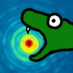

.. pyKLIP documentation master file, created by
   sphinx-quickstart on Thu Mar 12 16:05:49 2015.
   You can adapt this file completely to your liking, but it should at least
   contain the root `toctree` directive.

pyKLIP
==================================

pyKLIP is a python library for direct imaging of exoplanets and disks. It uses an implmentation of
`KLIP <http://arxiv.org/abs/1207.4197>`_ and `KLIP-FM <http://arxiv.org/abs/1604.06097>`_ to perform point spread
function (PSF) subtraction. KLIP is based off of principal component analysis to model and subtract off the stellar PSF
to look for faint exoplanets and disks and are around it.

pyKLIP is open source, BSD-licened, and available at
`this Bitbucket repo <https://bitbucket.org/pyKLIP/pyklip>`_. You can use the issue tracker there to submit issues and
all contributions are welcome!

Features
--------
* Capable of running ADI, SDI, ADI+SDI with spectral templates to optimize the PSF subtraction
* Library of KLIP-FM capabilties including forward-modelling a PSF, detection algorithms, and spectral extraction.
* A Forward Model Matched Filter of KLIP is available for GPI as well as post-processing planet detection algorithms.
* Parallelized with both a quick memory-intensive mode and a slower memory-lite mode
* Modularized to support data from multiple instruments. Currently there are interfaces to
  `P1640 <http://www.amnh.org/our-research/physical-sciences/astrophysics/research/project-1640>`_,
  `GPI <http://planetimager.org/>`_, SPHERE, MagAO/VisAO, and Keck/NIRC2.
* If confused about what a function is doing, read the docstring for it. We have tried our best to document everything
* Version 1.1 - see :ref:`release-notes` for update notes

Bugs/Feature Requests
------------------------

Please use the `Issue Tracker <https://bitbucket.org/pyKLIP/pyklip/issues?status=new&status=open>`_ on Bitbucket to
submit bugs and new feature requests. Anyone is able to open issues.

Attribution
-----------------------
The development of pyKLIP is led by Jason Wang with contributions made by Jonathan Aguilar, JB Ruffio, Rob de Rosa, 
Schuyler Wolff, Abhijith Rajan, Zack Briesemeister, Kate Follette, Maxwell Millar-Blanchaer, Alexandra Greenbaum, 
Simon Ko, Tom Esposito, Elijah Spiro, Pauline Arriaga, Bin Ren, Alan Rainot, and Laurent Pueyo. 
If you use this code, please cite the Astrophysical Source Code Library record of it (`ASCL <http://ascl.net/1506.001>`_ or
`ADS <http://adsabs.harvard.edu/abs/2015ascl.soft06001W>`_)

 *Wang, J. J., Ruffio, J.-B., De Rosa, R. J., et al. 2015, Astrophysics Source Code Library, ascl:1506.001*

Contents
--------

.. toctree::
   :maxdepth: 2
   :caption: Setup

   install
   release_notes
   
.. toctree::
   :maxdepth: 2
   :caption: Tutorials

   klip_gpi
   instruments/index
   contrast_curves
   bka
   fm_spect
   fmmf
   kpop_gpi
   diskfm_gpi
   rdi
   developing/index
   pyklip

Indices and tables
==================

* :ref:`genindex`
* :ref:`modindex`
* :ref:`search`

